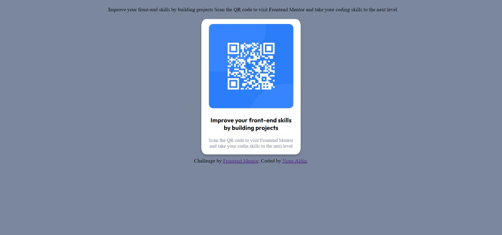

# Frontend Mentor - QR code component solution

This is a solution to the [QR code component challenge on Frontend Mentor](https://www.frontendmentor.io/challenges/qr-code-component-iux_sIO_H). Frontend Mentor challenges help you improve your coding skills by building realistic projects. 

## Table of contents

- [Overview](#overview)
  - [Screenshot](#screenshot)
  - [Links](#links)
  - [Built with](#built-with)
  - [What I learned](#what-i-learned)
  - [Useful resources](#useful-resources)
- [Author](#author)

## Overview
Creating responsive QR Card using CSS and html. 

### Screenshot

### Links

- Solution URL: [Add solution URL here](https://your-solution-url.com)
- Live Site URL: [Add live site URL here](https://your-live-site-url.com)

### Built with

- CSS custom properties
- Html

### What I learned

I learned how to make custom Responsive card. 

### Useful resources

- [Example resource 1](https://www.w3schools.com) - This helped me for @media syntax . 

## Author

- Frontend Mentor - [@nour-aldin](https://www.frontendmentor.io/profile/nour-aldin)
- Linkedin - [@Nour Aldin](https://www.linkedin.com/in/nour-aldin-02b9b41b7/)

